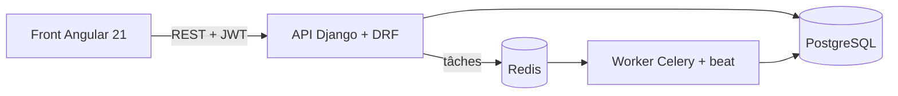

# Open Skills Assessment

Une application de tests de compétences : un recruteur compose un test à partir d'une banque de
questions classées par compétence, envoie un lien au candidat, et reçoit un rapport détaillé
par compétence.

> **État du projet** : en cours de construction (M1 Socle). Les sections marquées « à venir »
> seront complétées au fil des milestones.

_Badges (CI, couverture, licence) : à venir._

## Démo

_À venir (M6) : vidéos du parcours recruteur, du passage du test et du rapport._

## Problème résolu

Évaluer un candidat en comptabilité, finance ou gestion demande du temps, et le résultat est
rarement comparable d'un candidat à l'autre. Cette application fait passer le même test, dans
les mêmes conditions et dans un temps contrôlé par le serveur, puis calcule un score par
compétence. Chaque entreprise ne voit que ses propres questions, tests et candidats.

## Démarrage rapide

_À venir (fin de M1) : la stack Docker et le Makefile ne sont pas encore en place._

```bash
cp .env.example .env
make up
```

## Architecture

Architecture cible. Le worker Celery arrive en M3 et le front Angular en M6.



Le repo est un monorepo :

| Dossier | Contenu |
|---------|---------|
| `backend/` | API Django + Django REST Framework |
| `frontend/` | Application Angular 21 |
| `e2e/` | Tests de bout en bout Playwright |
| `docs/adr/` | Décisions d'architecture |

## Choix techniques

- **Django + DRF plutôt que FastAPI** : admin, ORM et migrations intégrés pour une application
  surtout CRUD. Voir l'[ADR 0001](docs/adr/0001-choix-django.md).
- **Redis comme seul broker Celery** : un service de moins à opérer, avec des tâches
  idempotentes en contrepartie. Voir l'[ADR 0002](docs/adr/0002-redis-broker-celery.md).
- **JWT hybride** : access token en mémoire, envoyé en en-tête `Authorization: Bearer` ;
  refresh token dans un cookie `HttpOnly`, illisible par JavaScript et réservé aux endpoints
  d'authentification. Voir l'[ADR 0003](docs/adr/0003-jwt-hybride-cookie-bearer.md).
- **Sécurisé par défaut** : `DEBUG` désactivé et authentification requise sur tout endpoint,
  sauf exception explicite.
- **Isolation multi-entreprises** : chaque requête d'API est filtrée par l'organisation de
  l'utilisateur, avec un test d'isolation par ressource.
- **Le serveur fait foi** : l'échéance d'un test est calculée et vérifiée côté serveur, jamais
  côté navigateur.

## Tests

_À venir (M1) : tests backend avec pytest, lancés par `make test`._

## Feuille de route et limites connues

| Milestone | Contenu | État |
|-----------|---------|------|
| M1 Socle | Repo, Docker, CI, organisations et utilisateurs, authentification JWT | en cours |
| M2 Banque de questions | CRUD, filtres, import et export JSON, permissions par organisation | à venir |
| M3 Composition et invitation | Constructeur de test, invitation par e-mail, lien candidat sans compte | à venir |
| M4 Passage du test | Minuteur côté serveur, sauvegarde automatique des réponses | à venir |
| M5 Correction et rapport | Correction automatique, scores par compétence, rapport PDF | à venir |
| M6 Front et démo | Tableau de bord recruteur, tests E2E, vidéos de démo | à venir |
| M7 IA (optionnel) | Brouillons de questions générés par LLM, relus par le recruteur | à venir |

Limites connues :

- le projet n'est pas encore utilisable : seul le squelette du repo existe ;
- pas de temps réel (suivi en direct d'une session), voir l'ADR 0001 ;
- garanties de livraison des tâches plus faibles qu'avec RabbitMQ, voir l'ADR 0002 ;
- le front et l'API doivent être servis depuis le même site (API sous `/api` derrière un
  reverse proxy), et le logout laisse l'access token valable jusqu'à 15 minutes, voir
  l'ADR 0003.
